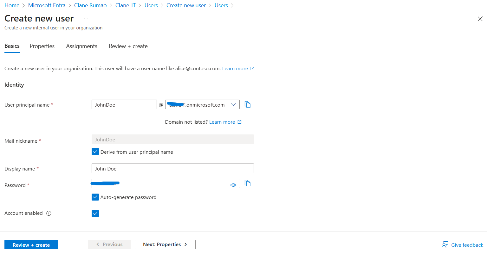
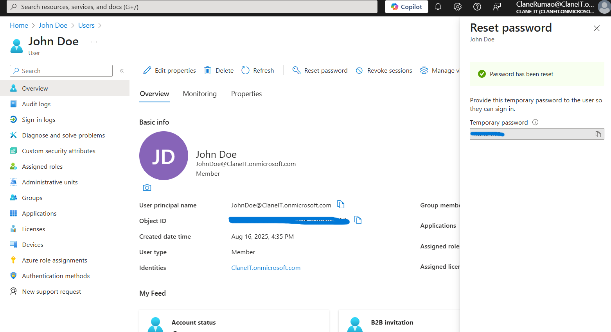
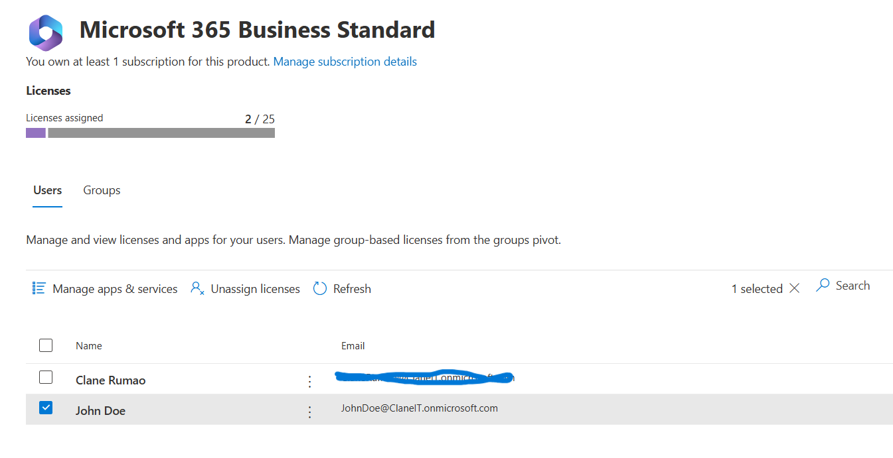

# Microsoft 365 + Entra ID User Lifecycle Lab Workflow

This lab demonstrates **onboarding, managing, and offboarding employees** in Microsoft 365 and Entra ID (Azure AD).

---

## 1️⃣ Set up Microsoft 365 Tenant
- Go to Microsoft 365 Business Basic/Standard trial → Try free for 1 month.
- Create tenant with custom domain (e.g., yourname.onmicrosoft.com).
- Set global admin credentials and log in at Admin Center.

---

## 2️⃣ Access Entra ID (Azure AD)
- Go to [entra.microsoft.com](https://entra.microsoft.com)
- Explore **Users** and **Groups** sections.

---

## 3️⃣ Create a New User
- Entra ID → Users → New user → Fill details:
  - Name: John Doe
  - Username: johndoe@yourtenant.onmicrosoft.com
  - Password: Auto-generate
  - Assign Microsoft 365 Business Basic license → Save

---

## 4️⃣ Assign Group Membership
- Groups → New group → Sales Team → Add John Doe

---

## 5️⃣ Simulate First Login
- Open Incognito → Login as John Doe → Change password
- Access Outlook to verify mailbox

---

## 6️⃣ Reset Password
- Admin → Users → John Doe → Reset password

---

## 7️⃣ Block & Unblock Sign-in
-Admin Center → Users → Test account → Block sign-in → check → save
-Admin Center → Users → Test account → unblock sign-in → uncheck → save

---

## 8️⃣ Remove License & Delete User
- John Doe → Licenses → Unassign → Delete

---

## 9️⃣ Restore Deleted User
- Deleted Users → Select John Doe → Restore

---

## 🔹 10️⃣ Create Azure AD Groups for Departments
- Groups → New group → HR Department → Add members manually
- Repeat for IT Department and Finance Department

---

## 🔹 11️⃣ Assign Users to Groups
- Add users manually to HR, IT, Finance groups

---

## 🔹 12️⃣ Configure MFA
- Admin Center → Users → Active Users → Manage multifactor authentication → Enable

---

## 🔹 13️⃣ Log in as User & Complete MFA Setup
- Incognito → John Doe → Set up Authenticator/SMS

---

## 🔹 14️⃣ Bulk User Creation
- Users → Bulk create → Upload CSV → Assign licenses

---

## 🔹 15️⃣ Assign Licenses & Groups
- Users → Active Users → Select multiple → Assign license
- Groups → Add members manually

---

## 🔹 16️⃣ Password Reset Simulation
- Users → John Doe → Reset password
- Audit Logs → Verify event recorded

---

## 🔹 17️⃣ Simulate Offboarding Process
### Disable Sign-In
- Entra ID → John Doe → Block sign-in = Yes

### Remove from All Groups
- Groups → Remove John Doe from HR/IT/Finance

### Remove Licenses and deleting user
- John Doe → Licenses → Unassign

---

